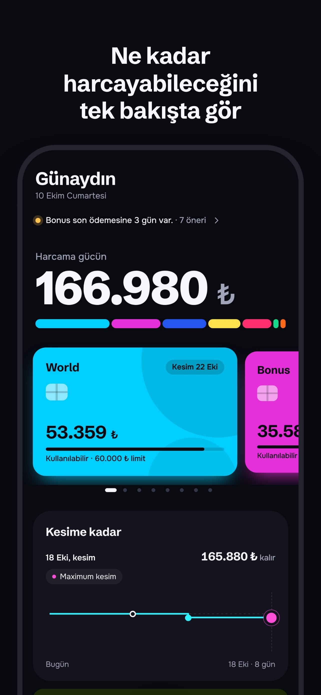
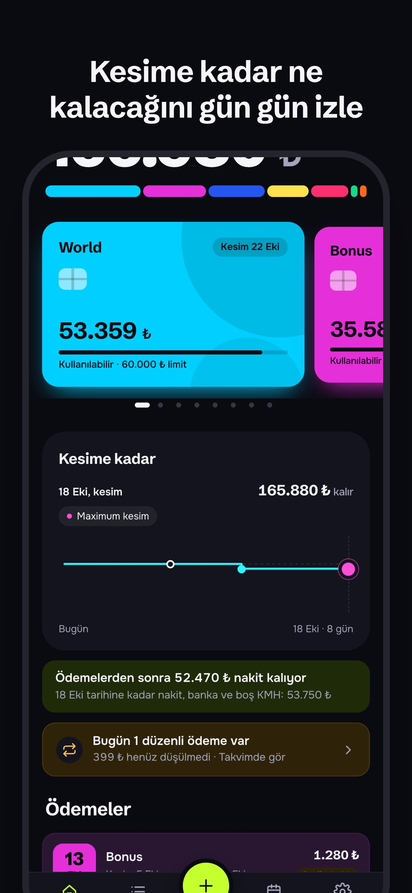
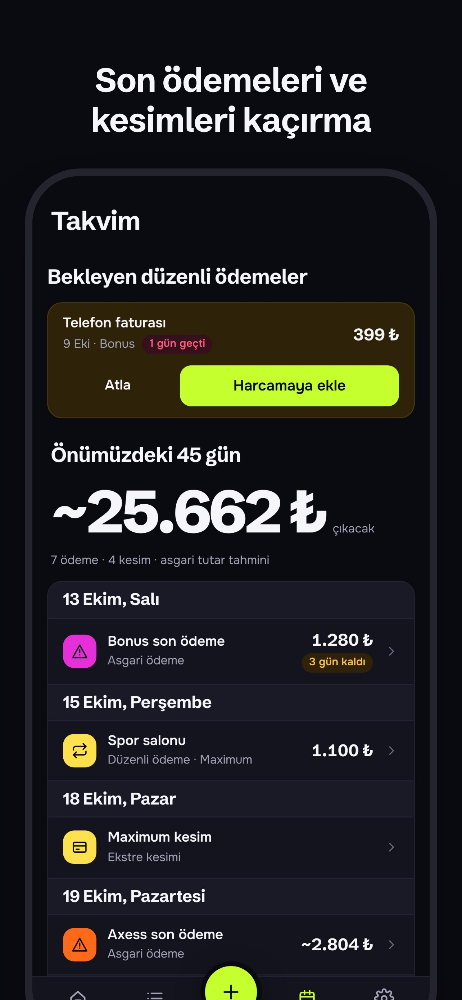
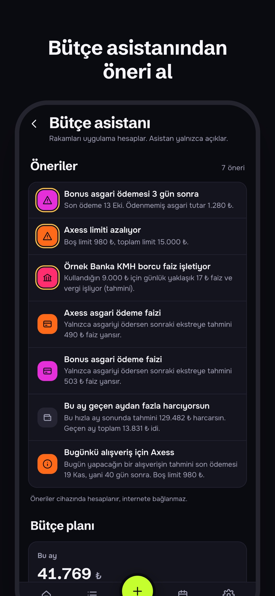

<p align="center">
  
</p>

<h1 align="center">Kart Limitlerim</h1>

<p align="center">
  Kredi kartlarındaki ve KMH'deki boş limitten <b>şu an gerçekte ne kadar harcayabileceğini</b> gösteren bütçe uygulaması.
</p>

<p align="center">
  <a href="https://github.com/mirzayildiran/kart-limitlerim/actions/workflows/ci.yml"></a>
  <a href="https://github.com/mirzayildiran/kart-limitlerim/actions/workflows/deploy.yml"></a>
  <a href="LICENSE"></a>
</p>

<p align="center">
  <a href="https://mirzayildiran.github.io/kart-limitlerim/">Canlı sürüm</a>
</p>

<p align="center">
  
  
  
  
</p>

---

## Neden?

Bütçe uygulamalarının çoğu "ne kadar borcun var" sorusunu cevaplar. Kart Limitlerim tersinden bakar:

- **Harcama gücü:** Bütün kartlardaki boş limit, KMH'deki boş limit ve nakit tek rakamda.
- **İleriye bakış:** Asgari ödemeler ve düzenli ödemeler çıktıktan sonra bir sonraki kesime kadar elinde ne kalacağı.
- **Faiz tahmini:** Kesimden sonra yalnızca asgariyi ödersen gelecek ekstrede ne kadar faiz çıkacağı (akdi faiz, KKDF, BSMV dahil).
- **Ekran görüntüsünden aktarma:** Banka uygulamasının ekran görüntüsünü at, harcamalar telefonda okunup listeye eklensin. Görüntü hiçbir sunucuya gitmez.

## Özellikler

| Durum | Özellik |
|:-:|---|
| ✅ | Kartlar, KMH, nakit ve hesaplar; kullanılabilir limite göre sıralı |
| ✅ | Kesim ve son ödeme takvimi, asgari ödeme takibi |
| ✅ | Harcamalar, kendi oluşturduğun kategoriler ve taksitli harcamalar |
| ✅ | Düzenli ödemeler ve takvim |
| ✅ | Son ödeme hafta sonuna ya da resmi tatile (bayramlar dahil) denk gelirse bir sonraki iş gününe kayar |
| ✅ | Faiz tahmini: kesimden sonraki faiz ve kart başına toplam işleyen faiz (TCMB azami oranları, KKDF, BSMV) |
| ✅ | Ekran görüntüsünden harcama aktarma (cihaz üzerinde OCR) |
| ✅ | Bütçe asistanı: cihazda hesaplanan öneriler, kategori hedefleri; onayla açılan isteğe bağlı sohbet |
| ✅ | Yedek alma ve geri yükleme (sürümlü, doğrulanan JSON) |
| ✅ | Açık ve koyu tema, büyük metin, hareketi azalt ve kontrastı artır tercihleri |
| ✅ | iPhone uygulaması: Face ID kilidi, son ödeme bildirimleri, otomatik yerel yedek, ana ekran hızlı eylemleri |
| ⏳ | App Store sürümü ([yapılacaklar](docs/APP_STORE.md)) |

Ayrıntılı plan için [yol haritasına](docs/ROADMAP.md) bak.

## Nasıl çalışır

- **Harcama gücü:** Kartlardaki, KMH'deki ve nakit hesaplardaki kullanılabilir tutarların toplamı. Kart ve KMH için kullanılabilir tutar boş limittir. Ana ekranda "Şu an harcayabileceğin" altında gösterilen tutar budur.
- **Kesime kadar:** Harcama gücünden, bugünden bir sonraki ekstre kesimine kadar çıkacak düzenli ödemeler düşülür. Kalan tutar, o tarihe kadar harcayabileceğin miktardır.
- **Ödemelerden sonra nakit:** Nakit, banka bakiyesi ve boş KMH'den; kesime kadar vadesi gelen asgari ödemeler ve nakitten çekilecek düzenli ödemeler düşülür. Eksi çıkarsa ekranda ne kadar eksik olduğu yazar. Kartın asgarisini ödemek harcama gücünü değiştirmez, nakdi azaltır.

## Ekran görüntüsünden aktarma

Banka uygulamasındaki harcama listesinin ekran görüntüsünü seçersin. Okuma telefonda, tarayıcının içinde yapılır. Görüntü hiçbir yere gönderilmez ve saklanmaz.

Tanınan bankalar:

- Ziraat Dinamik
- Ziraat Bankkart
- Akbank
- İş Bankası
- Garanti

Tanınmayan düzenler de genel bir okuyucuyla denenir; bu durumda satırları daha dikkatli kontrol et.

Okuma sonrası her satır onay ekranında görünür. Ödeme ve iade satırları harcama olarak alınmaz. Aktarılan harcamalar varsayılan olarak kullanılabilir limiti düşürmez, çünkü banka uygulaması limiti zaten düşmüş gösterir. Limiti az önce güncellediysen de kapalı bırak. Gerekirse onay ekranındaki **Kullanılabilir limitten de düş** anahtarını aç.

Gerçek ekran görüntüleriyle yapılan ölçümde beş bankada 29 satırın 28'i doğru okundu. Yine de her satırı kaydetmeden önce kontrol et.

## Gizlilik

- Bütün veriler **yalnızca senin cihazında** (IndexedDB) saklanır. Hesap, sunucu ya da takip kodu yok.
- Banka şifresi veya kart numarası **hiçbir zaman istenmez**.
- Ekran görüntüleri cihazda okunur ve okunduktan sonra saklanmaz.
- Bütçe asistanı sohbeti kapalıdır. Açarsan, onay ekranında tamamını gördüğün bir özet ve mesajların gönderilir; tek tek harcamalar ve notlar gönderilmez, adlardaki uzun rakamlar ve e-postalar maskelenir.

Ayrıntılar için [gizlilik politikasına](docs/PRIVACY.md) bak.

## Geliştirme

Gereksinim: Node.js 22+

```bash
npm install
npm run dev              # geliştirme sunucusu
npm run lint             # ESLint (uyarı sınırı 0) ve CSS renk kontrolü
npm test                 # birim ve bileşen testleri (Vitest; bileşenler happy-dom'da)
npm run test:components  # yalnızca bileşen testleri
npm run build            # üretim derlemesi (dist/)
npm run size             # ilk yükleme bütçesi: JS ≤ 40 KB, CSS ≤ 12 KB (gzip)
npm run e2e              # uçtan uca testler (Playwright, 390×844, koyu ve açık tema, axe)
npm run check:csp        # derlenmiş uygulamada CSP ihlali denetimi
npm run knip             # ölü kod ve kullanılmayan dışa aktarımlar
```

Uçtan uca testler Playwright'ın Chromium'unu kullanır (`npx playwright install chromium`) ya da `CHROME_PATH` ile verilen tarayıcıyı.

iPhone uygulaması (Capacitor) için: `npm run ios:build`, `npm run ios:open`, canlı test için `npm run ios:dev`. Ayrıntılar [docs/IOS.md](docs/IOS.md).

`main` dalına yapılan her gönderim CI'dan (tip, lint, knip, birim, bileşen ve uçtan uca testler, CSP, paket boyutu) geçer ve GitHub Pages'e yayınlanır; asistan Worker'ı da aynı iş akışıyla kurulur.

### Teknoloji

[Preact](https://preactjs.com/) · TypeScript · [Vite](https://vite.dev/) · [vite-plugin-pwa](https://vite-pwa-org.netlify.app/) · IndexedDB ([idb](https://github.com/jakearchibald/idb)) · [Tesseract.js](https://tesseract.projectnaptha.com/) · [@preact/signals](https://github.com/preactjs/signals) · [Capacitor](https://capacitorjs.com/) · Cloudflare Workers · Vitest · Playwright

### Belgeler

- [Mimari](docs/ARCHITECTURE.md): klasörler, veri akışı, tembel yükleme, otomatik yedek, platform katmanı, faiz formülü, OCR hattı
- [Güvenlik denetimi](docs/SECURITY.md)
- [iOS](docs/IOS.md) ve [App Store hazırlığı](docs/APP_STORE.md)
- [Tasarım dili](DESIGN.md)
- [Yol haritası](docs/ROADMAP.md)
- [Değişiklik günlüğü](CHANGELOG.md)
- [Gizlilik politikası](docs/PRIVACY.md)

## Uyarı

Faiz ve asgari ödeme hesapları, TCMB ve BDDK'nın yayımladığı kurallara dayanan **tahminlerdir**. Kesin tutar bankanın ekstresinde yazandır. Bu uygulama finansal danışmanlık sunmaz.

## Lisans

[MIT](LICENSE)
